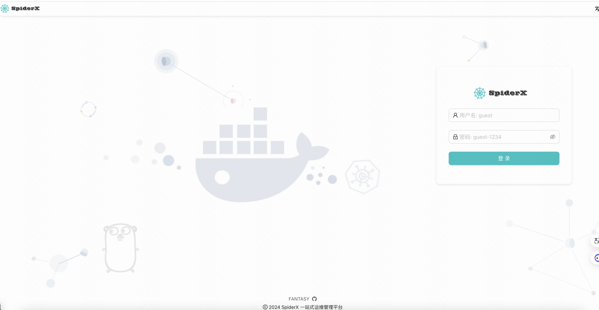
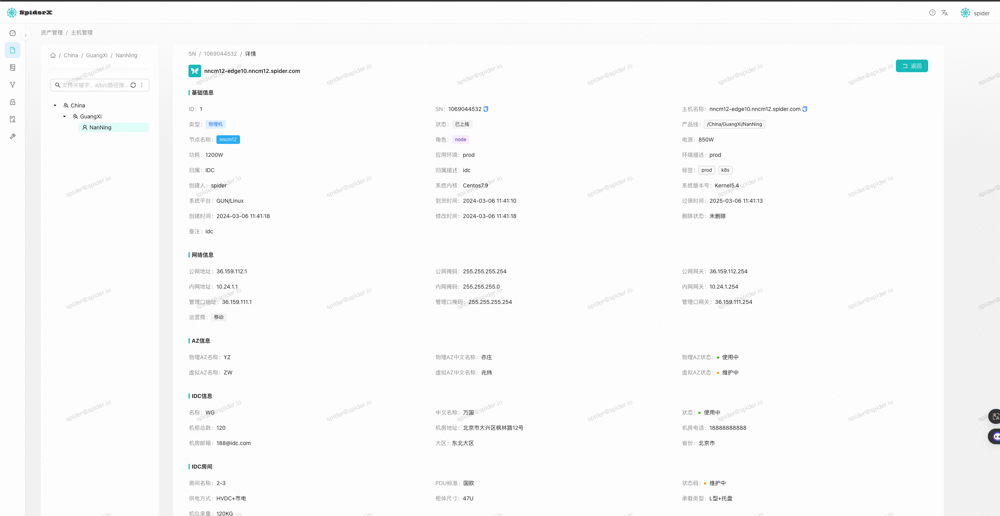
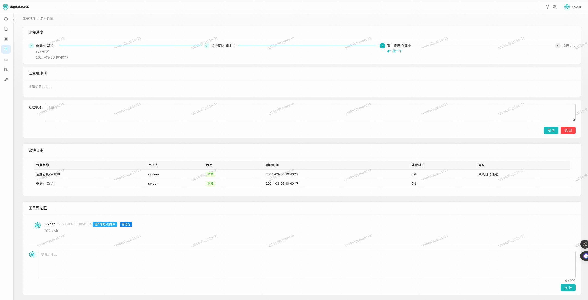
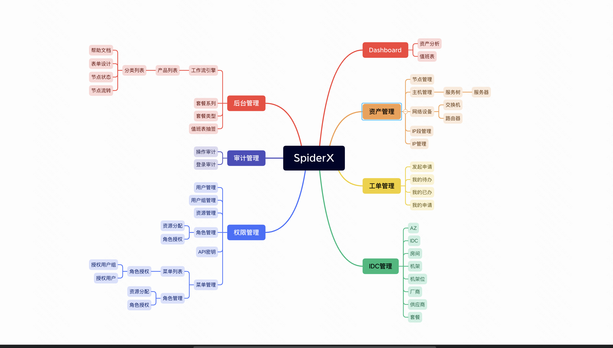

# spiderX

SpiderX是一款完全开源一站式运维管理平台，拥有完整的RBAC权限控制、CMDB资产管理、OA工作流引擎功能、日志审计等功能

### 在线体验
[点击访问](https://spider.igolang.cn)

用户名: guest 
密码: guest-1234





## Features
- 基于 RBAC（Role based access control）的权限管理，前端、后端支持用户/用户组->角色-资源的操作，使用户安全操作性能搞。
- 完善的运维CMDB管理，基于资产管理服务器、节点、IP段、交换机、路由器、IP段、IP管理，IDC内划分为AZ、IDC、房间、机架、机架位。
- 实现了一套灵活的工作流引擎，流程管理员可基于后台灵活性的配置工作流表单字段、节点状态、控制流转，从而适配不同工单类型。
- 提供完整审计模块，每一次操作都有完整的审计功能，用户与资源、方法绑定，用于历史审查。
- 动态值班功能，基于抽签方式进行用户的值班，可基于周/天纬度进行动态推算，支持换班。
- 基于apiKey开放式调用，用户可申请token进行接口调用访问，基于RBAC权限控制。

## 功能概览


## 项目组件
- Spider-api: api后端项目，具体细分为apiserver、job、openapi。
- Spider-fe: web-ui前端项目，所有前端的页面均在该项目中。

## 项目依赖
- Golang 1.19+ ([installation manual](https://go.dev/dl/))
- Node.js v18+  
- Npm 9.5+
- MySQL 5.7+ 

## 快速启动
请确认好本地已安装好项目所需要的依赖
- 克隆代码
```
git clone https://github.com/YuZongYangHi/spiderX
```
- 安装前端所依赖模块
```
cd spiderX/spider-fe && tyarn 
```
- 启动前端
```
tyarn start 
```

- 确认配置文件相关信息
```
cat spiderX/spider-api/cmd/apiserver/apiserver.yaml
```
- 初始化表结构
```
cd spiderX/spider-api/db.makemigrations/apiserver

# 依次sourc以下SQL文件
1、db_struct.sql
2、menu.sql
3、rbac_api.sql
```
- 启动后端
```
cd spiderX/spider-api/cmd/apiserver && go run apiserver.go --config apiserver.yaml
```

- 登录
```
user: spider
password: Aa123456
```

## 关于项目
整个项目大概持续不到一年，投入人力1，目前算是一个一期的里程碑，好的项目、好用的项目离不开大家的反馈，希望大家有任何疑问可联系我，或通过反馈方式。

二期我会继续做新的功能，基于用户的使用反馈我们会不断持续迭代，目前已知在二期加入的功能：
- 作业管理 
- 链路探活
- 装机管理
- 监控管理

## 联系我们
- 邮箱: 2747582092@qq.com
- 项目迭代知识库(反馈)：https://www.yuque.com/ellison-wxun9/zrt42c
- 开源项目地址：https://github.com/YuZongYangHi/spiderX
- 演示地址：https://spider.igolang.cn
- 技术论坛：https://igolang.cn
- qq群：170286861


